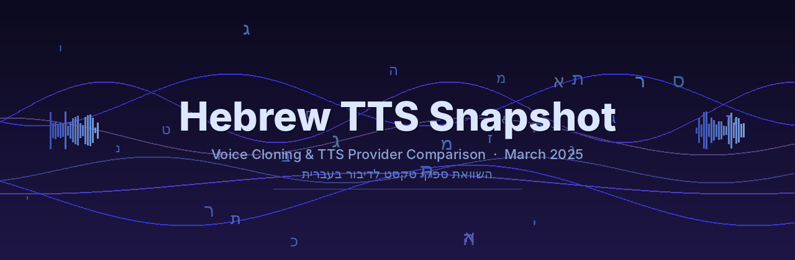

# Hebrew TTS Snapshot

A snapshot of Hebrew text-to-speech capabilities as of 22 March 2025, comparing voice quality across multiple TTS providers — including voice cloning experiments via Replicate.

## Key Findings

| Provider | Approach | Hebrew Quality | Notes |
|----------|----------|---------------|-------|
| **MiniMax** | Voice cloning (Replicate) | **Best** | Most impressive results — cloned voices sounded natural in Hebrew |
| **Edge TTS** | Stock voices (Avri, Hila) | Good | Microsoft's free TTS; tested at 100% and 70% speed |
| **Gemini** | Stock voices (Puck, Zephyr) | Good | Via Google AI Studio, Gemini 2.5 Flash Preview TTS |
| **ElevenLabs** | Stock voices (v3 model) | Good | Requires `language_code: "he"` — multilingual v2 is unintelligible |
| **Chatterbox** | Voice cloning (Replicate) | Poor | Output was generic; cloning didn't carry through to Hebrew |
| **Resemble AI** | Stock + voice cloning | Poor | Needs nekudot (diacritics) for intelligible output |

## Voice Cloning Method

Voice clones for MiniMax and Chatterbox were generated using **Replicate**:
1. ~1 minute of English source audio per voice (see `voice-sources/english/`)
2. Voice clone IDs created on Replicate from those samples
3. Hebrew text generated using the cloned voice IDs with Hebrew language parameter
4. Hebrew reference audio also tested (see `voice-sources/hebrew/`)

MiniMax used the **T2A v2.6 Turbo** model with voice clones and Hebrew boost enabled.

## Repository Structure

```
├── samples/                    # Generated TTS audio output
│   ├── chatterbox/             # Chatterbox multilingual voice cloning (via Replicate)
│   │   ├── run1/               # English reference audio, unvowelised input
│   │   └── run2/               # Hebrew reference audio
│   ├── edge-tts/               # Microsoft Edge TTS
│   │   ├── avri-100pc/         # Avri voice, normal speed
│   │   ├── avri-70pc/          # Avri voice, 70% speed
│   │   ├── hila-100pc/         # Hila voice, normal speed
│   │   └── hila-70pc/          # Hila voice, 70% speed
│   ├── elevenlabs/             # ElevenLabs v3 model (Rachel, Adam, Bella)
│   ├── gemini/                 # Google Gemini 2.5 Flash Preview TTS (Puck, Zephyr)
│   ├── minimax/                # MiniMax T2A v2.6 Turbo voice clones (Corn, Herman)
│   └── resemble/               # Resemble AI
│       ├── stock/              # Avigail (Hebrew preset voice)
│       └── voice-clone/        # Chatterbox multilingual clone (Herman)
├── voice-sources/              # Input audio used for voice cloning
│   ├── english/                # ~1 min English samples (corn, daniel, herman)
│   └── hebrew/                 # Hebrew reference samples
│       ├── corn/
│       ├── daniel/
│       └── herman/
├── texts/                      # Hebrew text prompts
│   ├── source/                 # Texts used for TTS generation (+ PDF versions)
│   └── target/                 # Additional test texts (cooking, music, weather)
└── resources.md                # Links to related tools and services
```

## Provider Details

### MiniMax (Best Results)

- **Model:** T2A v2.6 Turbo
- **Method:** Voice clones created on Replicate, Hebrew boost enabled
- **Voices tested:** Corn, Herman

### Edge TTS

- **Voices:** Avri (male), Hila (female)
- **Speed variants:** 100% (normal) and 70% (slowed)
- **Texts:** Family, Jerusalem, sample text, travel, and more

### ElevenLabs

- **Model:** `eleven_v3` with `language_code: "he"`
- **Voices:** Rachel (F), Adam (M), Bella (F)
- **Note:** Multilingual v2 (`eleven_multilingual_v2`) produces unintelligible Hebrew. v3 with explicit Hebrew language code is required.

### Google Gemini

- **Model:** Gemini 2.5 Flash Preview TTS
- **Interface:** Google AI Studio
- **Voices:** Puck, Zephyr

### Chatterbox (via Resemble/Replicate)

- **Engine:** Chatterbox Multilingual
- **Method:** Voice cloning via Replicate API with `language: "he"`
- **Result:** Output sounded generic — voice cloning did not carry through to Hebrew
- **Issue in Run 2:** Dicta ONNX model not loaded; output was still gibberish

### Resemble AI

- **Stock voice:** Avigail (Hebrew preset) — usable but limited
- **Custom clones:** Unintelligible without nekudot (diacritics) in input text

## Resources

- [Phonikud TTS](https://huggingface.co/spaces/thewh1teagle/phonikud-tts) — Hebrew TTS with automatic diacritization
- [Add Diacritics in Hebrew](https://huggingface.co/spaces/thewh1teagle/add-diacritics-in-hebrew) — Diacritics preprocessor
- [LightBlue TTS Hebrew](https://huggingface.co/spaces/thewh1teagle/lightblue-tts-hebrew) — Open source Hebrew TTS
- [Ivrit.ai](https://www.ivrit.ai/en/ivrit-ai-2/) — Israeli speech technology
- [Replicate TTS Collection](https://replicate.com/collections/text-to-speech) — TTS models on Replicate
